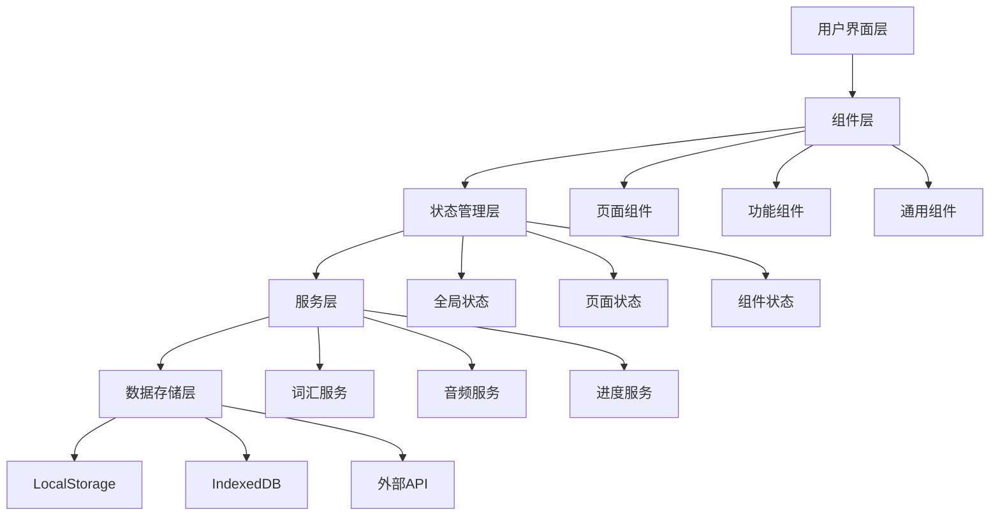

# Design Document

## Overview

Web3.0 DeFi词汇大作战是一个基于React和Chakra UI构建的移动端优先的词汇学习应用。该应用采用现代化的组件化架构，支持响应式设计，并提供丰富的交互体验。设计重点关注用户体验、性能优化和可维护性。

## Architecture

### 整体架构模式
采用**组件化单页应用(SPA)**架构：
- **表现层**: React组件 + Chakra UI
- **状态管理层**: React Context + useReducer
- **数据服务层**: 自定义Hooks + API服务
- **存储层**: LocalStorage + IndexedDB

### 技术架构图


## Components and Interfaces

### 核心组件设计

#### 1. 应用入口组件
```typescript
// App.tsx
interface AppProps {}

const App: React.FC<AppProps> = () => {
  return (
    <ChakraProvider theme={customTheme}>
      <VocabularyProvider>
        <ProgressProvider>
          <Router>
            <Layout>
              <Routes />
            </Layout>
          </Router>
        </ProgressProvider>
      </VocabularyProvider>
    </ChakraProvider>
  );
};
```

#### 2. 布局组件
```typescript
// components/Layout.tsx
interface LayoutProps {
  children: React.ReactNode;
}

const Layout: React.FC<LayoutProps> = ({ children }) => {
  return (
    <Box minH="100vh" bg="gray.50">
      <TopNavigation />
      <Box flex="1" pb="60px">
        {children}
      </Box>
      <BottomNavigation />
    </Box>
  );
};
```

#### 3. 单词卡片组件
```typescript
// components/vocabulary/WordCard.tsx
interface WordCardProps {
  word: VocabularyItem;
  onFlip: () => void;
  onSwipe: (direction: 'left' | 'right') => void;
  onFavorite: (wordId: string) => void;
  onPlayAudio: (word: string) => void;
}

const WordCard: React.FC<WordCardProps> = ({
  word,
  onFlip,
  onSwipe,
  onFavorite,
  onPlayAudio
}) => {
  const [isFlipped, setIsFlipped] = useState(false);
  
  return (
    <MotionBox
      whileHover={{ scale: 1.02 }}
      whileTap={{ scale: 0.98 }}
      {...swipeHandlers}
    >
      <Card>
        {/* 卡片内容 */}
      </Card>
    </MotionBox>
  );
};
```

#### 4. 练习组件
```typescript
// components/practice/QuizComponent.tsx
interface QuizComponentProps {
  question: QuizQuestion;
  onAnswer: (answer: string) => void;
  timeLimit: number;
}

const QuizComponent: React.FC<QuizComponentProps> = ({
  question,
  onAnswer,
  timeLimit
}) => {
  return (
    <VStack spacing={4}>
      <Timer duration={timeLimit} />
      <QuestionDisplay question={question} />
      <AnswerOptions onSelect={onAnswer} />
      <ProgressIndicator />
    </VStack>
  );
};
```

### 状态管理接口

#### 词汇状态管理
```typescript
// contexts/VocabularyContext.tsx
interface VocabularyState {
  vocabulary: VocabularyItem[];
  currentWord: VocabularyItem | null;
  favorites: string[];
  loading: boolean;
  error: string | null;
}

interface VocabularyActions {
  loadVocabulary: () => Promise<void>;
  addWord: (word: VocabularyItem) => void;
  toggleFavorite: (wordId: string) => void;
  generateWeb3Words: () => Promise<void>;
  setCurrentWord: (word: VocabularyItem) => void;
}
```

#### 进度状态管理
```typescript
// contexts/ProgressContext.tsx
interface ProgressState {
  dailyStats: DailyStats;
  streakDays: number;
  masteredWords: number;
  achievements: Achievement[];
  practiceHistory: PracticeSession[];
}

interface ProgressActions {
  updateDailyStats: (stats: Partial<DailyStats>) => void;
  addPracticeSession: (session: PracticeSession) => void;
  unlockAchievement: (achievementId: string) => void;
  resetProgress: () => void;
}
```

## Data Models

### 词汇数据模型
```typescript
interface VocabularyItem {
  id: string;
  word: string;
  definition: string;
  pronunciation: string;
  audioUrl?: string;
  examples: string[];
  category: Web3Category;
  difficulty: DifficultyLevel;
  tags: string[];
  createdAt: Date;
  updatedAt: Date;
}

enum Web3Category {
  BLOCKCHAIN = 'blockchain',
  DEFI = 'defi',
  NFT = 'nft',
  TRADING = 'trading',
  PROTOCOL = 'protocol'
}

enum DifficultyLevel {
  BEGINNER = 'beginner',
  INTERMEDIATE = 'intermediate',
  ADVANCED = 'advanced'
}
```

### 用户进度数据模型
```typescript
interface UserProgress {
  userId: string;
  dailyStats: DailyStats;
  streakDays: number;
  totalStudyTime: number;
  masteredWords: string[];
  weakWords: string[];
  achievements: Achievement[];
  settings: UserSettings;
}

interface DailyStats {
  date: string;
  wordsStudied: number;
  practicesSessions: number;
  correctAnswers: number;
  totalAnswers: number;
  studyTimeMinutes: number;
}

interface Achievement {
  id: string;
  name: string;
  description: string;
  icon: string;
  unlockedAt?: Date;
  progress: number;
  target: number;
}
```

### 练习题目数据模型
```typescript
interface QuizQuestion {
  id: string;
  type: QuestionType;
  word: VocabularyItem;
  question: string;
  options?: string[];
  correctAnswer: string;
  explanation?: string;
  timeLimit: number;
}

enum QuestionType {
  MULTIPLE_CHOICE = 'multiple_choice',
  FILL_BLANK = 'fill_blank',
  LISTENING = 'listening',
  DRAG_DROP = 'drag_drop'
}

interface PracticeSession {
  id: string;
  startTime: Date;
  endTime: Date;
  questions: QuizQuestion[];
  answers: UserAnswer[];
  score: number;
  accuracy: number;
}
```

## Error Handling

### 错误处理策略
1. **网络错误**: 显示重试按钮和离线提示
2. **数据加载错误**: 使用Skeleton组件和错误边界
3. **音频播放错误**: 提供备用发音方案
4. **存储错误**: 数据备份和恢复机制

```typescript
// components/common/ErrorBoundary.tsx
class ErrorBoundary extends React.Component<Props, State> {
  constructor(props: Props) {
    super(props);
    this.state = { hasError: false, error: null };
  }

  static getDerivedStateFromError(error: Error): State {
    return { hasError: true, error };
  }

  componentDidCatch(error: Error, errorInfo: React.ErrorInfo) {
    console.error('Error caught by boundary:', error, errorInfo);
    // 发送错误报告到监控服务
  }

  render() {
    if (this.state.hasError) {
      return <ErrorFallback error={this.state.error} />;
    }

    return this.props.children;
  }
}
```

## Testing Strategy

### 测试层级
1. **单元测试**: 组件逻辑和工具函数
2. **集成测试**: 组件间交互和数据流
3. **端到端测试**: 用户完整流程测试

### 测试工具配置
```typescript
// vitest.config.ts
export default defineConfig({
  test: {
    environment: 'jsdom',
    setupFiles: ['./src/test/setup.ts'],
    globals: true,
  },
  plugins: [react()],
});

// 测试示例
describe('WordCard Component', () => {
  it('should flip when clicked', async () => {
    const mockWord = createMockWord();
    render(<WordCard word={mockWord} onFlip={jest.fn()} />);
    
    const card = screen.getByTestId('word-card');
    fireEvent.click(card);
    
    expect(screen.getByText(mockWord.definition)).toBeInTheDocument();
  });
});
```

### 响应式设计测试
```typescript
// 测试不同屏幕尺寸下的布局
describe('Responsive Layout', () => {
  it('should show single column on mobile', () => {
    Object.defineProperty(window, 'innerWidth', {
      writable: true,
      configurable: true,
      value: 375,
    });
    
    render(<HomePage />);
    expect(screen.getByTestId('mobile-layout')).toBeInTheDocument();
  });
});
```

## Performance Optimization

### 性能优化策略
1. **代码分割**: React.lazy + Suspense
2. **组件优化**: React.memo + useMemo + useCallback
3. **图片优化**: WebP格式 + 懒加载
4. **数据缓存**: React Query + LocalStorage
5. **Bundle优化**: Tree shaking + 压缩

```typescript
// 代码分割示例
const PracticePage = lazy(() => import('./pages/Practice'));
const ProgressPage = lazy(() => import('./pages/Progress'));

// 组件优化示例
const WordCard = React.memo<WordCardProps>(({ word, onFlip }) => {
  const handleFlip = useCallback(() => {
    onFlip(word.id);
  }, [word.id, onFlip]);

  const cardContent = useMemo(() => {
    return formatWordContent(word);
  }, [word]);

  return <Card onClick={handleFlip}>{cardContent}</Card>;
});
```

### 音频性能优化
```typescript
// 音频预加载和缓存
class AudioManager {
  private cache = new Map<string, HTMLAudioElement>();
  
  async preloadAudio(urls: string[]) {
    const promises = urls.map(url => this.loadAudio(url));
    await Promise.allSettled(promises);
  }
  
  private async loadAudio(url: string): Promise<void> {
    if (this.cache.has(url)) return;
    
    const audio = new Audio(url);
    audio.preload = 'auto';
    
    return new Promise((resolve, reject) => {
      audio.addEventListener('canplaythrough', () => {
        this.cache.set(url, audio);
        resolve();
      });
      audio.addEventListener('error', reject);
    });
  }
}
```

## Accessibility

### 无障碍访问支持
1. **键盘导航**: Tab键顺序和快捷键
2. **屏幕阅读器**: ARIA标签和语义化HTML
3. **颜色对比**: WCAG 2.1 AA标准
4. **字体大小**: 支持用户缩放

```typescript
// 无障碍组件示例
const AccessibleWordCard: React.FC<WordCardProps> = ({ word }) => {
  return (
    <Card
      role="button"
      tabIndex={0}
      aria-label={`Word: ${word.word}, Definition: ${word.definition}`}
      onKeyDown={(e) => {
        if (e.key === 'Enter' || e.key === ' ') {
          handleFlip();
        }
      }}
    >
      <Text fontSize="xl" fontWeight="bold">
        {word.word}
      </Text>
      <Button
        aria-label={`Play pronunciation of ${word.word}`}
        onClick={() => playAudio(word.audioUrl)}
      >
        🔊
      </Button>
    </Card>
  );
};
```

## Security Considerations

### 安全措施
1. **输入验证**: 用户输入的词汇数据验证
2. **XSS防护**: 内容转义和CSP策略
3. **数据加密**: 敏感用户数据本地加密存储
4. **API安全**: 请求限制和错误处理

```typescript
// 输入验证示例
const validateVocabularyInput = (input: VocabularyInput): ValidationResult => {
  const errors: string[] = [];
  
  if (!input.word || input.word.trim().length === 0) {
    errors.push('Word is required');
  }
  
  if (input.word.length > 100) {
    errors.push('Word must be less than 100 characters');
  }
  
  if (!input.definition || input.definition.trim().length === 0) {
    errors.push('Definition is required');
  }
  
  return {
    isValid: errors.length === 0,
    errors
  };
};
```